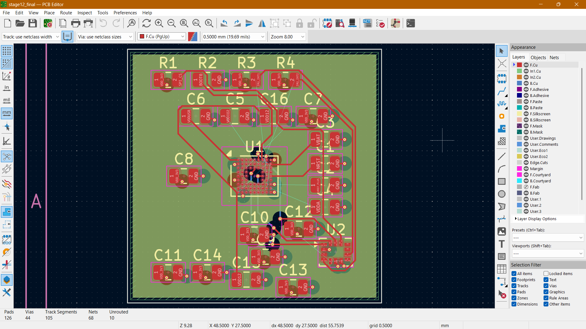
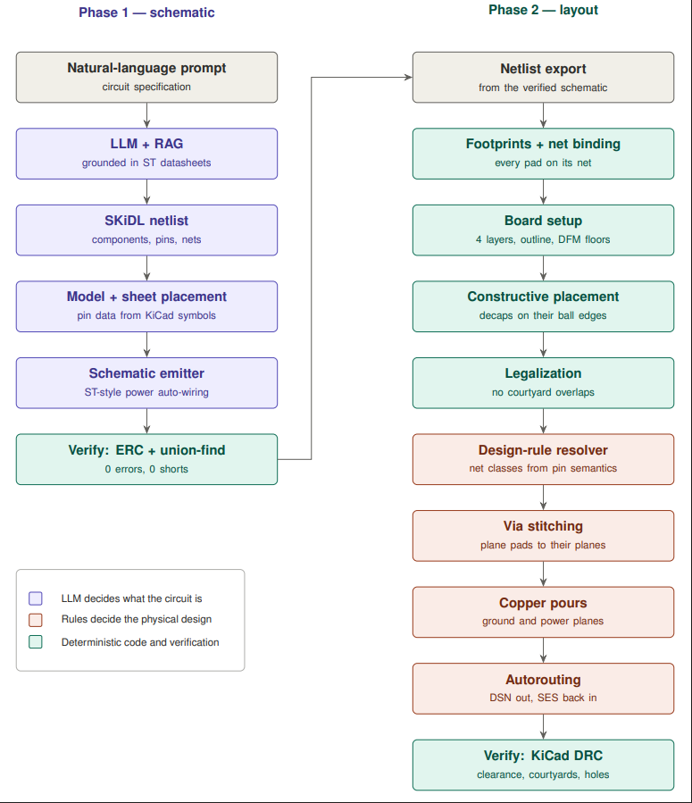
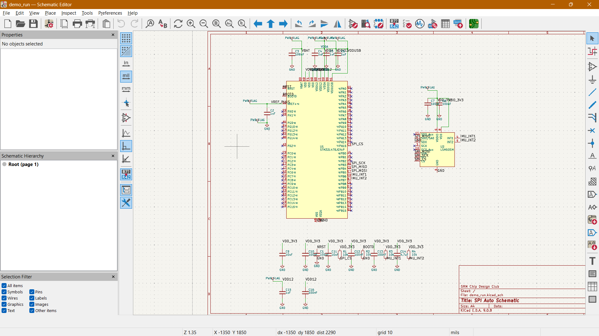
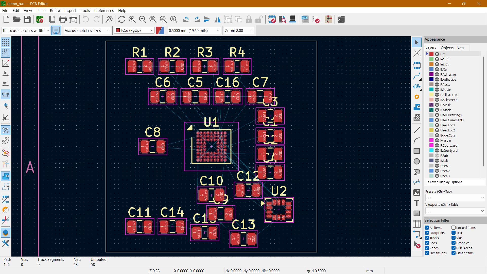

# LLM Driven End-to-End PCB Generation for KiCad

A pipeline that turns a natural-language circuit description into an ERC-verified KiCad 9 schematic and then into a placed, poured and routed `.kicad_pcb` — with no manual steps in between.

Design intent is guided by STMicroelectronics hardware design guidelines, with mentorship from ST engineers on layout practice. Manufacturability limits come from a fabricator's DFM specification. KiCad is treated as the single source of truth for every file format, and KiCad's own ERC and DRC verify the output independently of the code that produced it.



---

## Current status

The benchmark circuit is an **STM32L476JGYxP** microcontroller with an **LSM6DSM** inertial sensor over SPI — 22 components, 68 nets, 126 pads, on a 4-layer board.

| Measure | Result |
|---|---|
| Schematic ERC | 0 errors, 0 warnings |
| Pads bound to correct nets | 126 / 126, verified after reload |
| Courtyard overlaps | 0 |
| Copper clearance violations | 0 |
| Footprint errors | 0 |
| Unconnected items | 10 (from 58 before routing) |
| Routed copper | 105 traces, 44 vias |
| Plane connections stitched | 38 / 41 |

Remaining DRC output is 10 silkscreen warnings (reference-designator positioning), deferred to a later pass.

---

## Pipeline



The architecture rests on one separation, held throughout: **the language model decides what the circuit is; deterministic code decides what the files are.** The LLM never emits a coordinate, a trace width or a clearance. Conversely, no rule engine guesses which pin is a power pin — that comes from the netlist's own pin semantics.

### Phase 1 — schematic

1. **Generation** — an LLM, grounded by retrieval over ST datasheets, writes the circuit as SKiDL code.
2. **Parse and model** — components, pins and nets are built into a model, with authoritative pin data read from KiCad symbol libraries.
3. **Emit** — a native `.kicad_sch` is written, with power rails auto-wired in ST's drawing style (T-junctions where they fit, net labels where crowded).
4. **Verify twice** — an independent netlist-versus-drawing verifier (union-find over wire endpoints, labels and pin coordinates) runs alongside KiCad ERC.



### Phase 2 — layout

5. **Netlist export** — taken from the *verified schematic*, so the board provably inherits checked connectivity.
6. **Footprints and nets** — every footprint is loaded from KiCad's libraries and every pad bound to its net.
7. **Board setup** — 4-layer stackup, board outline, and manufacturability floors. Inner layers are declared as power planes, which propagates into the Specctra DSN and stops the autorouter fragmenting them with signal traces.
8. **Constructive placement** — the MCU is anchored, then each decoupling capacitor is placed on the same die edge as the power ball it serves, using ball coordinates measured from the real footprint. The sensor and its analog rails are zoned separately.
9. **Legalization** — a force-directed pass resolves courtyard overlaps against KiCad's own geometry.
10. **Design-rule resolver** — net classes are derived and rules resolved (below).
11. **Via stitching** — plane-net pads are connected to their planes with a via and a connecting track.
12. **Copper pours** — ground and power planes with thermal relief.
13. **Autorouting** — Freerouting, driven headless: DSN out, SES back in.
14. **Verify** — KiCad DRC.



---

## Design-rule resolution

Rules are resolved in three tiers, and every resolved value records where it came from:

| Tier | Source | Status |
|---|---|---|
| Manufacturability floor | Fabricator DFM specification | Sourced |
| Electrical requirement | IPC-2221 current-driven width | Formula verified; per-net current data not yet available |
| Convention and policy | ST guidelines, house policy | Partly unsourced — flagged in code |

Resolution is `max(fab floor, electrical requirement, practical minimum)`, and the provenance string on each value says which tier won. On the current benchmark every class resolves to the practical minimum, because the benchmark's currents are too small for the electrical tier to bind — the resolver reports this rather than implying the widths were engineered.

**Net classification is derived, not name-matched.** Classes come from `pinfunction` and `pintype` in the netlist, so a circuit whose nets are called `VSS`/`VDD` classifies identically to one using `GND`/`VDD_3V3`. This was verified against output from two different language models with incompatible naming conventions.

---

## Requirements

- WSL Ubuntu 22.04 (or Linux), Python 3.10
- KiCad 9 — symbol and footprint libraries, plus its bundled Python for `pcbnew`
- Freerouting 2.2.4 and a Java 25 runtime, for the routing stage
- An API key for the generation stage

## Usage

```bash
source venv/bin/activate
cd rag
python3 pipeline.py --name my_board
```

One command runs generation, schematic emission, verification, netlist export and layout. Outputs land in a folder containing the `.kicad_sch`, the `.net`, and the `.kicad_pcb` as a complete KiCad project.

To reuse an existing netlist and skip the LLM call, add `--skip-generate`.

---

## Limitations

These are known and deliberate, not hidden:

- **Three pads cannot be stitched to their planes.** On a 0.4 mm-pitch WLCSP, a through-via plus its connecting track physically cannot escape from an inner ball. The tool reports which pads failed rather than skipping them silently. Reaching them needs via-in-pad or microvias, neither of which is implemented.
- **Ten connections remain unrouted**, all terminating on inner balls of the same package — the same escape-routing limit.
- **Layer count is a constant, not a computed rule.** The 4-layer choice is correct for this package but is not yet derived from package pitch.
- **Several placement roles are hardcoded** to this board's reference designators. A circuit with a different component roster would need the role-derivation work that the resolver already demonstrates for nets.
- **The generation contract is implicit.** Downstream stages assume conventions that one model happened to satisfy; a second model's valid-but-different output broke them. A normalization stage is the fix.
- **Some rule values are policy, not sourced** — notably a power-net clearance that costs two connections. These are marked in code rather than presented as engineering.
- **Silkscreen positioning** is unaddressed; reference designators can overlap pads.

## Roadmap

Generalization of placement roles, a second benchmark on different parts, current-driven trace widths once per-net current data is available, and a datasheet-grounded functional check — the one class of error that neither ERC nor DRC can catch.
